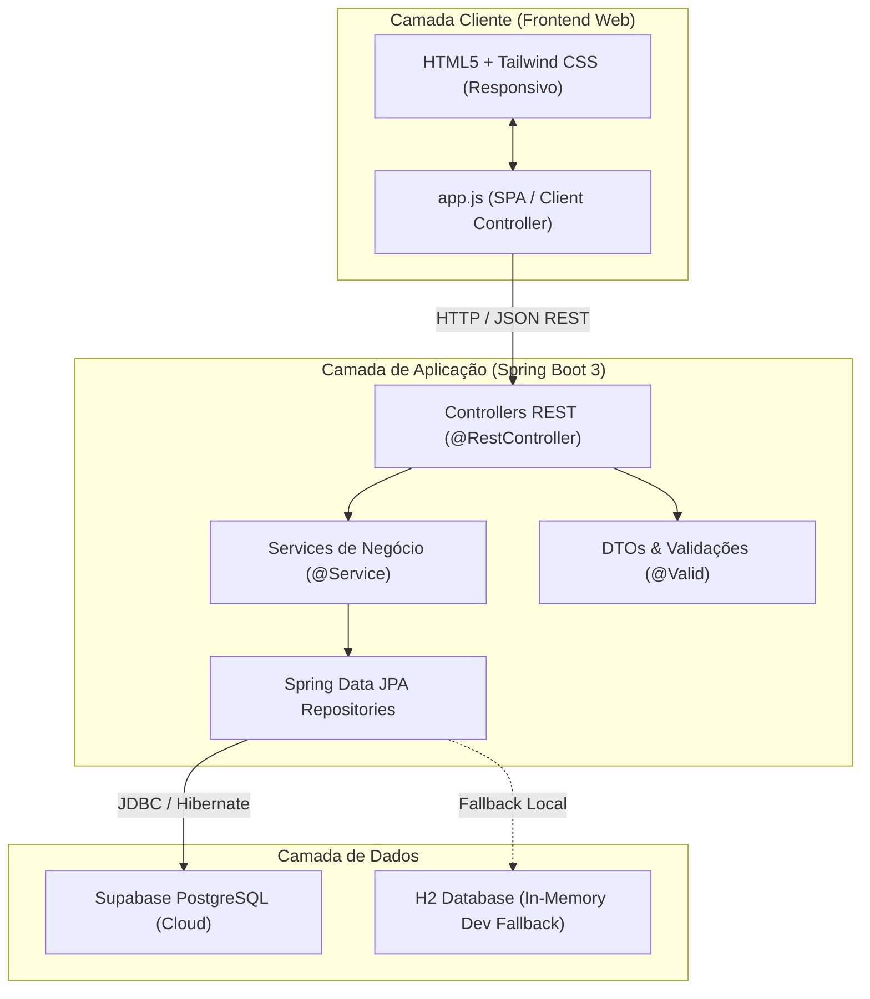
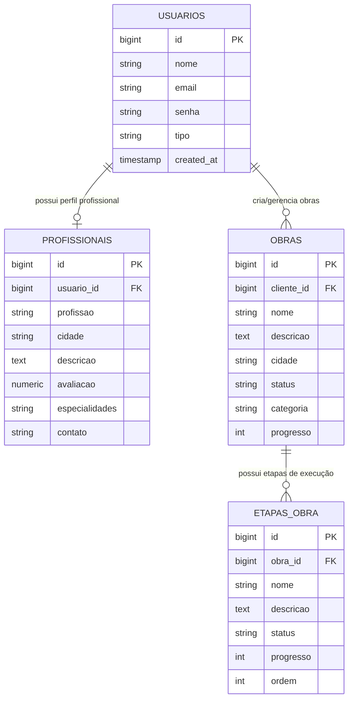

# 🏛️ Arquitetura do Sistema - Civil Connection

Documento técnico descritivo da arquitetura, fluxo de dados e separação em camadas da plataforma **Civil Connection**.

---

## 1. Visão Geral da Arquitetura

O sistema é estruturado em uma arquitetura em camadas desacoplada (Clean Layered Architecture), separando a apresentação visual, a API de negócio e a camada de persistência gerenciada pelo Supabase / PostgreSQL.

---

## 2. Camadas do Backend (`/backend`)

A aplicação Java segue as convenções e padrões empresariais do ecossistema Spring:

- **`config/`**:
  - `CorsConfig.java`: Configuração de Cross-Origin Resource Sharing para permitir consumo seguro pelo frontend.
  - `DataInitializer.java`: Carga automática de dados de inicialização caso o banco esteja vazio.
- **`controller/`**:
  - Exposição de endpoints RESTful com anotações `@RestController`, `@CrossOrigin` e mapeamento de rotas sob `/api/*`.
- **`service/`**:
  - Centralização de regras de negócio, validação e orquestração de transações (`@Transactional`).
- **`repository/`**:
  - Interfaces estendendo `JpaRepository` com suporte a paginação, ordenação e queries derivadas.
- **`model/`**:
  - Entidades JPA (`@Entity`) mapeadas para as tabelas relacionais do banco de dados.
- **`dto/`**:
  - Objetos de transferência de dados que isolam a representação pública da estrutura interna do banco de dados.
- **`exception/`**:
  - Tratamento centralizado de exceções através de `@RestControllerAdvice`, garantindo respostas JSON padronizadas e legíveis.

---

## 3. Modelo Entidade-Relacionamento

---

## 4. Integração Supabase & Segurança

1. **Persistência Relacional**: Supabase fornece um cluster PostgreSQL de alto desempenho com suporte a SSL.
2. **Segurança de Senhas**: As senhas de usuários são criptografadas no backend utilizando o algoritmo seguro **BCrypt** (`org.mindrot:jbcrypt`).
3. **Row Level Security (RLS)**: O arquivo [`database/rls-policies.sql`](../database/rls-policies.sql) garante que regras de controle de acesso operem no nível de dados.
